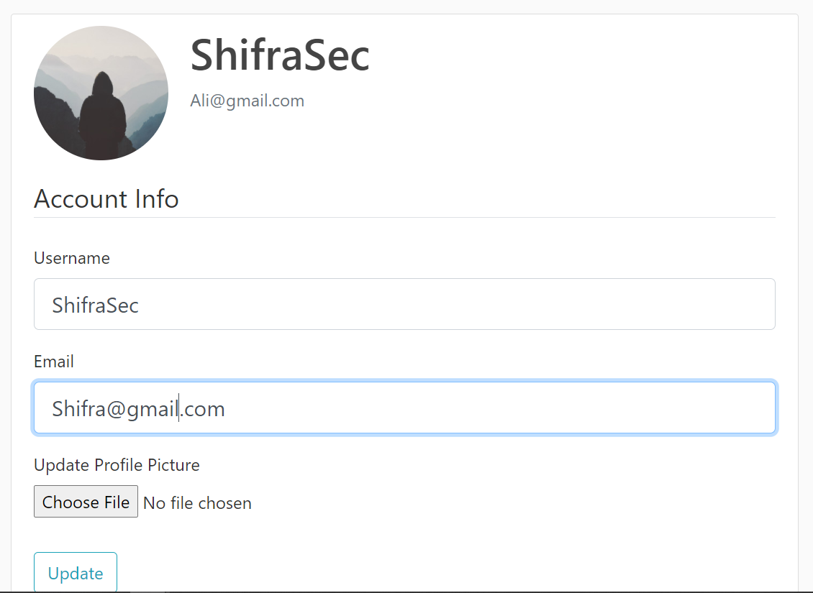

# :computer: Flask_Blog_Jira
A Simple Finished Blog WebApp built with flask and uses Flask-Jira to connect to the Atlassian Jira.

## :heavy_check_mark: Aim of the Project
learn building Flask WebApps and also connecting my project with Jira (how to get issues, comments and modify them ..etc) using Jira API.
## :camera_flash: Screenshots from the webapp:
### Main Page

### Changing your Profile Data

